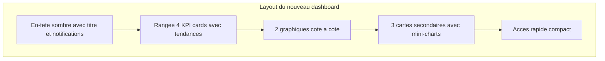

# Refonte du Dashboard Professionnel

## Etat actuel

Le fichier [DashboardPage.tsx](c:\Projet_Mika_Services\frontend_web\mika-services-frontend\src\features\dashboard\pages\DashboardPage.tsx) (~312 lignes) contient :

- 3 KPI cards gradient (projets, taches, budget)
- 2 barres de progression CSS simples
- Des cartes textuelles (alertes, securite, materiel)
- Un widget meteo (a supprimer)
- Des boutons d'acces rapide

**Problemes** : pas de graphique, pas de tendances, layout plat, KPI trop basiques, aucune data visualization.

## Architecture cible

Inspire de l'image de reference (header sombre, grands chiffres, graphiques, donut, sparklines), adapte au domaine BTP/construction.




## Design detaille

### 1. En-tete professionnel (header sombre)

- Bandeau fonce (`bg-gray-800/900`) avec titre "Tableau de bord" + date du jour
- Badges notifications/messages integres a droite du header (au lieu de boutons separes)

### 2. Rangee KPI (4 cartes)

Cartes blanches avec bordure gauche coloree, grand chiffre, sous-titre, indicateur de tendance.


| Carte           | Valeur                     | Sous-titre                 | Couleur                       |
| --------------- | -------------------------- | -------------------------- | ----------------------------- |
| Projets actifs  | `projets.enCours`          | X total, Y termines        | Bleu                          |
| Taches          | `planning.tachesTotal`     | X terminees, Y en retard   | Violet                        |
| Budget consomme | `budget.tauxConsommation%` | montant depense / prevu    | Vert/Orange/Rouge selon seuil |
| Qualite         | `qualite.tauxConformite%`  | X controles, Y NC ouvertes | Vert/Orange/Rouge selon seuil |


### 3. Graphiques principaux (2 colonnes)

**Gauche - BarChart horizontal** : Repartition des projets par statut

- Barres : En cours (bleu), Termines (vert), En retard (rouge)
- Utilise `recharts` BarChart avec layout vertical, Tooltip, Legend

**Droite - Donut PieChart** : Budget consomme vs restant

- 2 segments : depenses (orange) + restant (gris)
- Montant au centre (innerRadius)
- Legende en bas

### 4. Rangee secondaire (3 colonnes)

**Gauche - Avancement global** : 

- Donut/PieChart compact (taches terminees / en cours / en retard)
- Pourcentage au centre
- Legende coloree en dessous

**Centre - Securite et alertes** :

- Grands chiffres incidents + risques critiques
- Barre coloree par gravite (mini horizontal stacked bar)
- Jours d'arret affiches

**Droite - Materiel et stock** :

- BarChart vertical compact (total / disponibles / en service)
- Alerte stock bas si applicable

### 5. Acces rapide (compact)

- Rangee de chips/pills cliquables (au lieu de gros boutons)

## Fichier modifie

**Unique fichier** : `DashboardPage.tsx`

- Suppression de l'import `MeteoWidget` et du composant associe
- Remplacement du composant `KpiCard` interne par un nouveau `DashboardKpiCard` (defini dans le meme fichier)
- Ajout des imports recharts : `BarChart, Bar, PieChart, Pie, Cell, XAxis, YAxis, CartesianGrid, Tooltip, Legend, ResponsiveContainer`
- Ajout de sous-composants locaux : `DashboardHeader`, `DashboardChartCard`, `StatusDonut`
- Tout reste dans le meme fichier (pas de composants partages)

## Palette de couleurs (coherente avec le theme existant)

```typescript
const COLORS = {
  blue: '#3B82F6',
  green: '#22C55E', 
  red: '#EF4444',
  orange: '#F97316',
  purple: '#8B5CF6',
  gray: '#CBD5E1',
  darkBg: '#1E293B',
}
```

## Points de vigilance

- Zero modification du backend, des types, du store, ou de l'API
- Zero modification de `ReportingPage.tsx`
- Le fichier `MeteoWidget.tsx` reste en place (non supprime), simplement plus importe
- Les traductions existantes (`common.json` cle `dashboard.*`) sont reutilisees ; si nouvelles cles necessaires, elles seront ajoutees dans les fichiers de traduction `fr` et `en`
- Le dark mode est preserve (toutes les classes Tailwind avec prefixe `dark:`)
- La lib `recharts ^3.7.0` est deja installee, aucune dependance a ajouter

