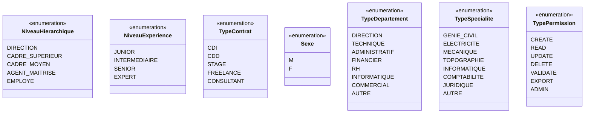
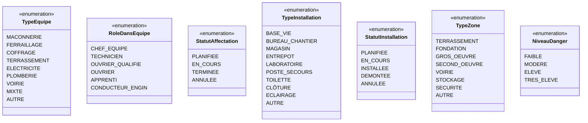
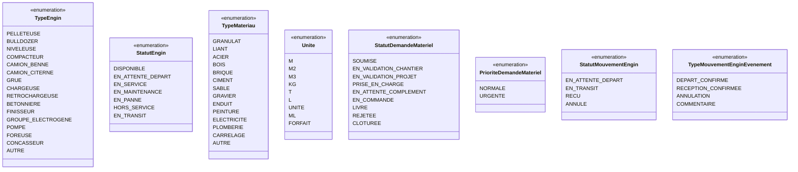
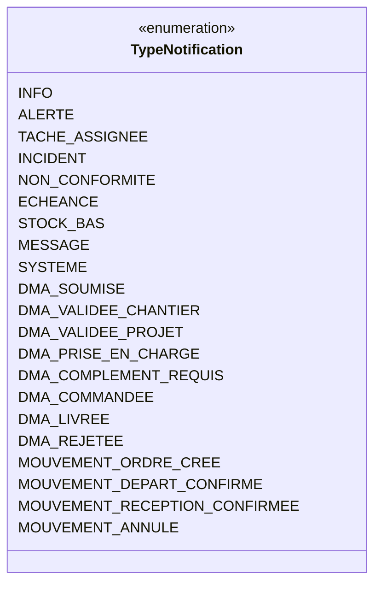
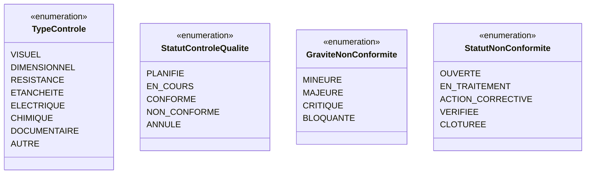
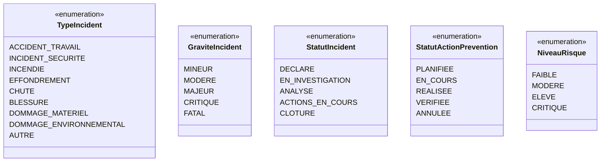
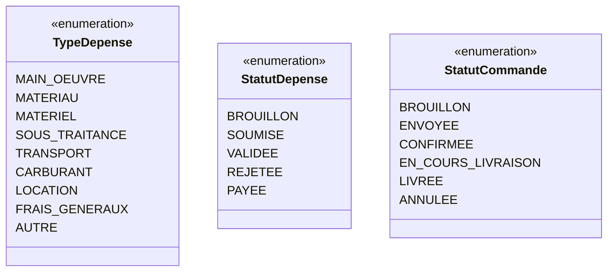
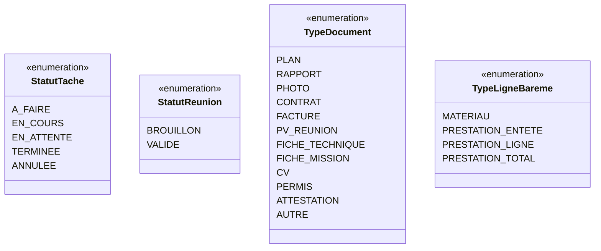

# Diagramme de Classes Complet — Mika Services Platform

> **Toutes les entités, tous les enums, toutes les relations inter-modules.**
> Généré depuis le code Kotlin réel (`backend/src/main/kotlin/…`).

---

## Sommaire

1. [Diagramme principal — Entités & Relations](#diagramme-principal)
2. [Enums par module](#enums-par-module)
3. [Index des entités](#index-des-entités)
4. [Relations cross-modules](#relations-cross-modules)

---

## Diagramme principal

```mermaid
classDiagram
    direction TB

    %% ═══════════════════════════════════════════════════
    %%   BASE
    %% ═══════════════════════════════════════════════════
    class BaseEntity {
        <<abstract>>
        +Long id
        +LocalDateTime createdAt
        +LocalDateTime updatedAt
        +String createdBy
        +String updatedBy
    }

    %% ═══════════════════════════════════════════════════
    %%   MODULE : UTILISATEURS & AUTH
    %% ═══════════════════════════════════════════════════
    class User {
        +String matricule
        +String nom
        +String prenom
        +String email
        +Sexe sexe
        +String motDePasse
        +String telephone
        +LocalDate dateNaissance
        +String adresse
        +String ville
        +String province
        +String numeroCNI
        +LocalDate dateEmbauche
        +String photo
        +String ficheMission
        +BigDecimal salaireMensuel
        +TypeContrat typeContrat
        +NiveauExperience niveauExperience
        +Boolean actif
        +LocalDateTime lastLogin
        +Boolean totpEnabled
        +Boolean mustChangePassword
        +Integer failedLoginAttempts
        +LocalDateTime lockoutUntil
        +Boolean emailNotificationsEnabled
        +Boolean inAppNotificationsEnabled
    }

    class Role {
        +String code
        +String nom
        +String description
        +NiveauHierarchique niveau
        +Boolean actif
    }

    class Permission {
        +String code
        +String nom
        +String module
        +TypePermission type
        +Boolean actif
    }

    class Departement {
        +String code
        +String nom
        +TypeDepartement type
        +Boolean actif
    }

    class Specialite {
        +Long id
        +String code
        +String nom
        +TypeSpecialite categorie
        +Boolean actif
    }

    class Session {
        +Long id
        +String token
        +String refreshToken
        +String ipAddress
        +String userAgent
        +String deviceName
        +LocalDateTime dateDebut
        +LocalDateTime dateExpiration
        +LocalDateTime lastActivity
        +Boolean active
    }

    class PasswordResetToken {
        +Long id
        +String token
        +LocalDateTime dateExpiration
        +Boolean used
    }

    class AuditLog {
        +Long id
        +String action
        +String module
        +String details
        +String ipAddress
        +LocalDateTime createdAt
    }

    %% ═══════════════════════════════════════════════════
    %%   MODULE : PROJET
    %% ═══════════════════════════════════════════════════
    class Projet {
        +String codeProjet
        +String numeroMarche
        +String nom
        +String description
        +TypeProjet type
        +StatutProjet statut
        +String province
        +String ville
        +Double latitude
        +Double longitude
        +BigDecimal montantHT
        +BigDecimal montantTTC
        +BigDecimal montantInitial
        +BigDecimal montantRevise
        +Integer delaiMois
        +LocalDate dateDebut
        +LocalDate dateFin
        +LocalDate dateDebutReel
        +LocalDate dateFinReelle
        +BigDecimal avancementGlobal
        +BigDecimal avancementPhysiquePct
        +BigDecimal avancementFinancierPct
        +SourceFinancement sourceFinancement
        +ConditionAcces conditionAcces
        +ZoneClimatique zoneClimatique
        +ModeSuiviMensuel modeSuiviMensuel
        +Boolean actif
    }

    class Client {
        +String code
        +String nom
        +TypeClient type
        +String ministere
        +String telephone
        +String email
        +String contactPrincipal
        +Boolean actif
    }

    class Partenaire {
        +String code
        +String nom
        +TypePartenaire type
        +String pays
        +String telephone
        +String email
        +Boolean actif
    }

    class SousProjet {
        +String code
        +String nom
        +TypeTravaux typeTravaux
        +StatutSousProjet statut
        +BigDecimal montantHT
        +BigDecimal montantTTC
        +Integer delaiMois
        +LocalDate dateDebut
        +LocalDate dateFin
        +BigDecimal avancementPhysique
    }

    class PointBloquant {
        +String titre
        +String description
        +Priorite priorite
        +StatutPointBloquant statut
        +LocalDate dateDetection
        +LocalDate dateResolution
        +String actionCorrective
    }

    class CAPrevisionnelRealise {
        +Integer mois
        +Integer annee
        +BigDecimal caPrevisionnel
        +BigDecimal caRealise
        +BigDecimal ecart
        +BigDecimal avancementCumule
    }

    class RevisionBudget {
        +BigDecimal ancienMontant
        +BigDecimal nouveauMontant
        +String motif
        +LocalDate dateRevision
    }

    class Prevision {
        +Integer semaine
        +Integer annee
        +TypePrevision type
        +LocalDate dateDebut
        +LocalDate dateFin
        +Integer avancementPct
    }

    class AvancementEtudeProjet {
        +PhaseEtude phase
        +BigDecimal avancementPct
        +LocalDate dateDepot
        +String etatValidation
    }

    %% ═══════════════════════════════════════════════════
    %%   MODULE : CHANTIER
    %% ═══════════════════════════════════════════════════
    class Equipe {
        +String code
        +String nom
        +TypeEquipe type
        +Integer effectif
        +Boolean actif
    }

    class MembreEquipe {
        +RoleDansEquipe role
        +LocalDate dateAffectation
        +LocalDate dateFin
        +Boolean actif
    }

    class AffectationChantier {
        +LocalDate dateDebut
        +LocalDate dateFin
        +StatutAffectation statut
        +String observations
    }

    class InstallationChantier {
        +TypeInstallation type
        +String description
        +LocalDate dateInstallation
        +LocalDate dateRetrait
        +StatutInstallation statut
    }

    class ZoneChantier {
        +String code
        +String nom
        +TypeZone type
        +Double latitude
        +Double longitude
        +BigDecimal superficie
        +NiveauDanger niveauDanger
        +Boolean actif
    }

    %% ═══════════════════════════════════════════════════
    %%   MODULE : MATÉRIEL & ENGINS
    %% ═══════════════════════════════════════════════════
    class Engin {
        +String code
        +String nom
        +TypeEngin type
        +String marque
        +String modele
        +String immatriculation
        +String numeroSerie
        +Integer anneeFabrication
        +LocalDate dateAcquisition
        +BigDecimal valeurAcquisition
        +Integer heuresCompteur
        +StatutEngin statut
        +String proprietaire
        +Boolean estLocation
        +BigDecimal coutLocationJournalier
        +Boolean actif
    }

    class Materiau {
        +String code
        +String nom
        +TypeMateriau type
        +Unite unite
        +BigDecimal prixUnitaire
        +BigDecimal stockActuel
        +BigDecimal stockMinimum
        +String fournisseur
        +Boolean actif
    }

    class AffectationEnginChantier {
        +LocalDate dateDebut
        +LocalDate dateFin
        +Integer heuresPrevues
        +Integer heuresReelles
        +StatutAffectation statut
        +String observations
    }

    class AffectationMateriauChantier {
        +BigDecimal quantiteAffectee
        +Unite unite
        +LocalDate dateAffectation
        +String observations
    }

    class DemandeMateriel {
        +String reference
        +StatutDemandeMateriel statut
        +PrioriteDemandeMateriel priorite
        +LocalDate dateSouhaitee
        +String commentaire
        +BigDecimal montantEstime
    }

    class DemandeMaterielLigne {
        +String designation
        +BigDecimal quantite
        +String unite
        +BigDecimal prixUnitaireEst
        +String fournisseurSuggere
    }

    class DemandeMaterielHistorique {
        +StatutDemandeMateriel deStatut
        +StatutDemandeMateriel versStatut
        +LocalDateTime dateTransition
        +String commentaire
    }

    class MouvementEngin {
        +StatutMouvementEngin statut
        +LocalDateTime dateDemande
        +LocalDateTime dateDepartConfirmee
        +LocalDateTime dateReceptionConfirmee
        +String commentaire
    }

    class MouvementEnginEvenement {
        +TypeMouvementEnginEvenement typeEvenement
        +LocalDateTime occurredAt
        +String payloadJson
    }

    %% ═══════════════════════════════════════════════════
    %%   MODULE : COMMUNICATION
    %% ═══════════════════════════════════════════════════
    class Message {
        +String sujet
        +String contenu
        +LocalDateTime dateEnvoi
        +Boolean lu
        +LocalDateTime dateLecture
    }

    class Notification {
        +String titre
        +String contenu
        +TypeNotification typeNotification
        +String lien
        +Boolean lu
        +LocalDateTime dateCreation
        +LocalDateTime dateLecture
    }

    class MessageMention {
        +Long id
    }

    class MessagePieceJointe {
        +String nomOriginal
        +String nomStockage
        +String cheminStockage
        +String typeMime
        +Long tailleOctets
    }

    class MessageSuppression {
        +Long id
        +LocalDateTime suppressedAt
    }

    class ConversationArchive {
        +Long id
        +Long peerUserId
        +LocalDateTime archivedAt
    }

    %% ═══════════════════════════════════════════════════
    %%   MODULE : PLANNING
    %% ═══════════════════════════════════════════════════
    class Tache {
        +String titre
        +String description
        +StatutTache statut
        +Priorite priorite
        +LocalDate dateDebut
        +LocalDate dateFin
        +LocalDate dateEcheance
        +Integer pourcentageAvancement
    }

    %% ═══════════════════════════════════════════════════
    %%   MODULE : QUALITÉ
    %% ═══════════════════════════════════════════════════
    class ControleQualite {
        +String reference
        +String titre
        +TypeControle typeControle
        +StatutControleQualite statut
        +LocalDate datePlanifiee
        +LocalDate dateRealisation
        +String zoneControlee
        +Integer noteGlobale
    }

    class NonConformite {
        +String reference
        +String titre
        +GraviteNonConformite gravite
        +StatutNonConformite statut
        +LocalDate dateDetection
        +LocalDate dateEcheanceCorrection
        +LocalDate dateCloture
        +String actionCorrective
    }

    %% ═══════════════════════════════════════════════════
    %%   MODULE : SÉCURITÉ
    %% ═══════════════════════════════════════════════════
    class Incident {
        +String reference
        +String titre
        +TypeIncident typeIncident
        +GraviteIncident gravite
        +StatutIncident statut
        +LocalDate dateIncident
        +LocalTime heureIncident
        +String lieu
        +Integer nbBlesses
        +Boolean arretTravail
        +Integer nbJoursArret
    }

    class ActionPrevention {
        +String titre
        +String description
        +StatutActionPrevention statut
        +LocalDate dateEcheance
        +LocalDate dateRealisation
    }

    class Risque {
        +String titre
        +NiveauRisque niveau
        +Integer probabilite
        +Integer impact
        +String zoneConcernee
        +String mesuresPrevention
        +Boolean actif
    }

    %% ═══════════════════════════════════════════════════
    %%   MODULE : BUDGET & FOURNISSEURS
    %% ═══════════════════════════════════════════════════
    class Depense {
        +String reference
        +String libelle
        +TypeDepense type
        +BigDecimal montant
        +LocalDate dateDepense
        +StatutDepense statut
        +String fournisseur
        +String numeroFacture
    }

    class Fournisseur {
        +String code
        +String nom
        +String telephone
        +String email
        +String contactNom
        +String specialite
        +Integer noteEvaluation
        +Boolean actif
    }

    class Commande {
        +String reference
        +String designation
        +BigDecimal montantTotal
        +StatutCommande statut
        +LocalDate dateCommande
        +LocalDate dateLivraisonPrevue
        +LocalDate dateLivraisonEffective
    }

    %% ═══════════════════════════════════════════════════
    %%   MODULE : DOCUMENT
    %% ═══════════════════════════════════════════════════
    class Document {
        +String nomFichier
        +String nomOriginal
        +String cheminStockage
        +String typeMime
        +Long tailleOctets
        +TypeDocument typeDocument
        +String description
    }

    %% ═══════════════════════════════════════════════════
    %%   MODULE : RÉUNION HEBDO
    %% ═══════════════════════════════════════════════════
    class ReunionHebdo {
        +LocalDate dateReunion
        +String lieu
        +LocalTime heureDebut
        +LocalTime heureFin
        +String ordreDuJour
        +StatutReunion statut
        +String divers
    }

    class ParticipantReunion {
        +String nomManuel
        +String prenomManuel
        +String initiales
        +String telephone
        +Boolean present
    }

    class PointProjetPV {
        +BigDecimal avancementPhysiquePct
        +BigDecimal avancementFinancierPct
        +BigDecimal delaiConsommePct
        +String resumeTravauxPrevisions
        +String pointsBloquantsResume
        +Integer ordreAffichage
    }

    %% ═══════════════════════════════════════════════════
    %%   MODULE : BARÈME
    %% ═══════════════════════════════════════════════════
    class CorpsEtatBareme {
        +String code
        +String libelle
        +Integer ordreAffichage
    }

    class FournisseurBareme {
        +String nom
        +String contact
    }

    class LignePrixBareme {
        +TypeLigneBareme type
        +String reference
        +String libelle
        +String unite
        +BigDecimal prixTtc
        +String famille
        +String categorie
        +String depot
        +BigDecimal quantite
        +BigDecimal prixUnitaire
        +BigDecimal somme
        +BigDecimal debourse
        +BigDecimal prixVente
        +BigDecimal coefficientPv
        +Integer ordreLigne
        +Boolean prixEstime
    }

    class BaremeMatRefSequence {
        +Integer annee
        +Integer dernierNumero
        +Long version
    }

    %% ═══════════════════════════════════════════════════
    %%   HÉRITAGE (BaseEntity)
    %% ═══════════════════════════════════════════════════
    BaseEntity <|-- User
    BaseEntity <|-- Role
    BaseEntity <|-- Permission
    BaseEntity <|-- Departement
    BaseEntity <|-- Projet
    BaseEntity <|-- Client
    BaseEntity <|-- Partenaire
    BaseEntity <|-- SousProjet
    BaseEntity <|-- PointBloquant
    BaseEntity <|-- CAPrevisionnelRealise
    BaseEntity <|-- RevisionBudget
    BaseEntity <|-- Prevision
    BaseEntity <|-- AvancementEtudeProjet
    BaseEntity <|-- Equipe
    BaseEntity <|-- MembreEquipe
    BaseEntity <|-- AffectationChantier
    BaseEntity <|-- InstallationChantier
    BaseEntity <|-- ZoneChantier
    BaseEntity <|-- Engin
    BaseEntity <|-- Materiau
    BaseEntity <|-- AffectationEnginChantier
    BaseEntity <|-- AffectationMateriauChantier
    BaseEntity <|-- DemandeMateriel
    BaseEntity <|-- DemandeMaterielLigne
    BaseEntity <|-- DemandeMaterielHistorique
    BaseEntity <|-- MouvementEngin
    BaseEntity <|-- MouvementEnginEvenement
    BaseEntity <|-- Message
    BaseEntity <|-- Notification
    BaseEntity <|-- MessagePieceJointe
    BaseEntity <|-- Tache
    BaseEntity <|-- ControleQualite
    BaseEntity <|-- NonConformite
    BaseEntity <|-- Incident
    BaseEntity <|-- ActionPrevention
    BaseEntity <|-- Risque
    BaseEntity <|-- Depense
    BaseEntity <|-- Fournisseur
    BaseEntity <|-- Commande
    BaseEntity <|-- Document
    BaseEntity <|-- ReunionHebdo
    BaseEntity <|-- ParticipantReunion
    BaseEntity <|-- PointProjetPV
    BaseEntity <|-- CorpsEtatBareme
    BaseEntity <|-- FournisseurBareme
    BaseEntity <|-- LignePrixBareme

    %% ═══════════════════════════════════════════════════
    %%   RELATIONS — MODULE UTILISATEURS
    %% ═══════════════════════════════════════════════════
    User "n" --> "0..1" User : superieurHierarchique
    User "n" --> "n" Role : user_roles
    User "n" --> "n" Departement : user_departements
    User "n" --> "n" Specialite : user_specialites
    Role "n" --> "n" Permission : role_permissions
    Departement "n" --> "0..1" User : responsable
    Session "n" --> "1" User : user
    PasswordResetToken "n" --> "1" User : user
    AuditLog "n" --> "0..1" User : user

    %% ═══════════════════════════════════════════════════
    %%   RELATIONS — MODULE PROJET
    %% ═══════════════════════════════════════════════════
    Projet "n" --> "0..1" Client : client
    Projet "n" --> "0..1" User : responsableProjet
    Projet "n" --> "n" Partenaire : projet_partenaires
    Projet "1" --> "n" SousProjet : sousProjets
    Projet "1" --> "n" PointBloquant : pointsBloquants
    Projet "1" --> "n" CAPrevisionnelRealise : caPrevisionnelsRealises
    Projet "1" --> "n" RevisionBudget : revisionsBudget
    Projet "1" --> "n" Prevision : previsions
    Projet "1" --> "n" AvancementEtudeProjet : avancementEtudes
    SousProjet "n" --> "0..1" User : responsable
    PointBloquant "n" --> "0..1" User : detectePar
    PointBloquant "n" --> "0..1" User : assigneA
    RevisionBudget "n" --> "0..1" User : validePar

    %% ═══════════════════════════════════════════════════
    %%   RELATIONS — MODULE CHANTIER
    %% ═══════════════════════════════════════════════════
    AffectationChantier "n" --> "1" Projet : projet
    AffectationChantier "n" --> "1" Equipe : equipe
    InstallationChantier "n" --> "1" Projet : projet
    ZoneChantier "n" --> "1" Projet : projet
    Equipe "1" --> "n" MembreEquipe : membres
    Equipe "n" --> "0..1" User : chefEquipe
    MembreEquipe "n" --> "1" User : user

    %% ═══════════════════════════════════════════════════
    %%   RELATIONS — MODULE MATÉRIEL & ENGINS
    %% ═══════════════════════════════════════════════════
    AffectationEnginChantier "n" --> "1" Engin : engin
    AffectationEnginChantier "n" --> "1" Projet : projet
    AffectationEnginChantier "n" --> "0..1" MouvementEngin : mouvementEngin
    AffectationMateriauChantier "n" --> "1" Materiau : materiau
    AffectationMateriauChantier "n" --> "1" Projet : projet
    DemandeMateriel "n" --> "1" Projet : projet
    DemandeMateriel "n" --> "1" User : createur
    DemandeMateriel "n" --> "0..1" Commande : commande
    DemandeMateriel "1" --> "n" DemandeMaterielLigne : lignes
    DemandeMateriel "1" --> "n" DemandeMaterielHistorique : historique
    DemandeMaterielLigne "n" --> "0..1" Materiau : materiau
    DemandeMaterielHistorique "n" --> "1" User : user
    MouvementEngin "n" --> "1" Engin : engin
    MouvementEngin "n" --> "0..1" Projet : projetOrigine
    MouvementEngin "n" --> "1" Projet : projetDestination
    MouvementEngin "n" --> "1" User : initiateur
    MouvementEnginEvenement "n" --> "1" MouvementEngin : mouvement
    MouvementEnginEvenement "n" --> "1" User : auteur

    %% ═══════════════════════════════════════════════════
    %%   RELATIONS — MODULE COMMUNICATION
    %% ═══════════════════════════════════════════════════
    Message "n" --> "1" User : expediteur
    Message "n" --> "1" User : destinataire
    Message "n" --> "0..1" Message : parent
    Notification "n" --> "1" User : destinataire
    MessageMention "n" --> "1" Message : message
    MessageMention "n" --> "1" User : user
    MessagePieceJointe "n" --> "1" Message : message
    MessageSuppression "n" --> "1" User : user
    MessageSuppression "n" --> "1" Message : message
    ConversationArchive "n" --> "1" User : user

    %% ═══════════════════════════════════════════════════
    %%   RELATIONS — MODULE PLANNING
    %% ═══════════════════════════════════════════════════
    Tache "n" --> "1" Projet : projet
    Tache "n" --> "0..1" User : assigneA
    Tache "n" --> "0..1" Tache : tacheParent

    %% ═══════════════════════════════════════════════════
    %%   RELATIONS — MODULE QUALITÉ
    %% ═══════════════════════════════════════════════════
    ControleQualite "n" --> "1" Projet : projet
    ControleQualite "n" --> "0..1" User : inspecteur
    ControleQualite "1" --> "n" NonConformite : nonConformites
    NonConformite "n" --> "0..1" User : responsableTraitement

    %% ═══════════════════════════════════════════════════
    %%   RELATIONS — MODULE SÉCURITÉ
    %% ═══════════════════════════════════════════════════
    Incident "n" --> "1" Projet : projet
    Incident "n" --> "0..1" User : declarePar
    Incident "1" --> "n" ActionPrevention : actionsPrevention
    ActionPrevention "n" --> "0..1" Incident : incident
    ActionPrevention "n" --> "0..1" User : responsable
    Risque "n" --> "1" Projet : projet

    %% ═══════════════════════════════════════════════════
    %%   RELATIONS — MODULE BUDGET & FOURNISSEURS
    %% ═══════════════════════════════════════════════════
    Depense "n" --> "1" Projet : projet
    Depense "n" --> "0..1" User : validePar
    Commande "n" --> "1" Fournisseur : fournisseur
    Commande "n" --> "0..1" Projet : projet
    Fournisseur "1" --> "n" Commande : commandes

    %% ═══════════════════════════════════════════════════
    %%   RELATIONS — MODULE DOCUMENT
    %% ═══════════════════════════════════════════════════
    Document "n" --> "0..1" Projet : projet
    Document "n" --> "0..1" User : uploadePar

    %% ═══════════════════════════════════════════════════
    %%   RELATIONS — MODULE RÉUNION HEBDO
    %% ═══════════════════════════════════════════════════
    ReunionHebdo "n" --> "0..1" User : redacteur
    ReunionHebdo "1" --> "n" ParticipantReunion : participants
    ReunionHebdo "1" --> "n" PointProjetPV : pointsProjet
    ParticipantReunion "n" --> "0..1" User : user
    PointProjetPV "n" --> "1" Projet : projet

    %% ═══════════════════════════════════════════════════
    %%   RELATIONS — MODULE BARÈME
    %% ═══════════════════════════════════════════════════
    LignePrixBareme "n" --> "1" CorpsEtatBareme : corpsEtat
    LignePrixBareme "n" --> "0..1" FournisseurBareme : fournisseurBareme
    LignePrixBareme "n" --> "0..1" LignePrixBareme : parent
    LignePrixBareme "1" --> "n" LignePrixBareme : enfants
```

---

## Enums par module

### Module Utilisateurs & Auth



### Module Projet

```mermaid
classDiagram
    class StatutProjet {
        <<enumeration>>
        EN_ATTENTE
        PLANIFIE
        EN_COURS
        SUSPENDU
        TERMINE
        ABANDONNE
        RECEPTION_PROVISOIRE
        RECEPTION_DEFINITIVE
    }
    class StatutSousProjet {
        <<enumeration>>
        PLANIFIE
        EN_COURS
        SUSPENDU
        TERMINE
        ABANDONNE
    }
    class TypeProjet {
        <<enumeration>>
        VOIRIE
        ROUTE
        CHAUSSEE
        PONT
        OUVRAGE_ART
        BATIMENT
        ASSAINISSEMENT
        TERRASSEMENT
        MIXTE
        GENIE_CIVIL
        REHABILITATION
        AMENAGEMENT
        AUTRE
    }
    class TypeTravaux {
        <<enumeration>>
        TERRASSEMENT
        GROS_OEUVRE
        SECOND_OEUVRE
        VOIRIE
        ASSAINISSEMENT
        ELECTRICITE
        PLOMBERIE
        AUTRE
    }
    class TypeClient {
        <<enumeration>>
        ETAT
        COLLECTIVITE
        PRIVE
        ONG
        INTERNATIONAL
        AUTRE
    }
    class TypePartenaire {
        <<enumeration>>
        SOUS_TRAITANT
        FOURNISSEUR
        BUREAU_ETUDES
        LABORATOIRE
        ASSUREUR
        AUTRE
    }
    class SourceFinancement {
        <<enumeration>>
        BUDGET_ETAT
        BANQUE_MONDIALE
        BAD
        BEI
        PRIVE
        MIXTE
        AUTRE
    }
    class ConditionAcces {
        <<enumeration>>
        FACILE
        DIFFICILE
        TRES_DIFFICILE
    }
    class ZoneClimatique {
        <<enumeration>>
        EQUATORIALE
        TROPICALE
        SAHELIENNE
        SEMI_ARIDE
    }
    class ModeSuiviMensuel {
        <<enumeration>>
        AUTO
        MANUEL
    }
    class Priorite {
        <<enumeration>>
        BASSE
        NORMALE
        HAUTE
        CRITIQUE
        URGENT
    }
    class StatutPointBloquant {
        <<enumeration>>
        OUVERT
        EN_COURS
        RESOLU
        FERME
    }
    class TypePrevision {
        <<enumeration>>
        TRAVAUX
        APPROVISIONNEMENT
        ETUDES
        REUNIONS
        AUTRE
    }
    class PhaseEtude {
        <<enumeration>>
        APS
        APD
        PRO
        DCE
        EXE
    }
```



### Module Chantier



### Module Matériel & Engins



### Module Communication



### Module Qualité



### Module Sécurité



### Module Budget & Fournisseurs



### Module Planning, Réunion, Document, Barème



---

## Index des entités

| # | Entité | Module | Table DB |
|---|--------|--------|----------|
| 1 | `User` | Utilisateurs | `users` |
| 2 | `Role` | Utilisateurs | `roles` |
| 3 | `Permission` | Utilisateurs | `permissions` |
| 4 | `Departement` | Utilisateurs | `departements` |
| 5 | `Specialite` | Utilisateurs | `specialites` |
| 6 | `Session` | Auth | `sessions` |
| 7 | `PasswordResetToken` | Auth | `password_reset_tokens` |
| 8 | `AuditLog` | Auth | `audit_logs` |
| 9 | `Projet` | Projet | `projets` |
| 10 | `Client` | Projet | `clients` |
| 11 | `Partenaire` | Projet | `partenaires` |
| 12 | `SousProjet` | Projet | `sous_projets` |
| 13 | `PointBloquant` | Projet | `points_bloquants` |
| 14 | `CAPrevisionnelRealise` | Projet | `ca_previsionnel_realise` |
| 15 | `RevisionBudget` | Projet | `revisions_budget` |
| 16 | `Prevision` | Projet | `previsions` |
| 17 | `AvancementEtudeProjet` | Projet | `avancement_etude_projet` |
| 18 | `Equipe` | Chantier | `equipes` |
| 19 | `MembreEquipe` | Chantier | `membres_equipe` |
| 20 | `AffectationChantier` | Chantier | `affectations_projet` |
| 21 | `InstallationChantier` | Chantier | `installations_projet` |
| 22 | `ZoneChantier` | Chantier | `zones_projet` |
| 23 | `Engin` | Matériel | `engins` |
| 24 | `Materiau` | Matériel | `materiaux` |
| 25 | `AffectationEnginChantier` | Matériel | `affectations_engin_projet` |
| 26 | `AffectationMateriauChantier` | Matériel | `affectations_materiau_projet` |
| 27 | `DemandeMateriel` | Matériel | `demandes_materiel` |
| 28 | `DemandeMaterielLigne` | Matériel | `demandes_materiel_lignes` |
| 29 | `DemandeMaterielHistorique` | Matériel | `demandes_materiel_historique` |
| 30 | `MouvementEngin` | Matériel | `mouvements_engin` |
| 31 | `MouvementEnginEvenement` | Matériel | `mouvements_engin_evenements` |
| 32 | `Message` | Communication | `messages` |
| 33 | `Notification` | Communication | `notifications` |
| 34 | `MessageMention` | Communication | `message_mentions` |
| 35 | `MessagePieceJointe` | Communication | `message_pieces_jointes` |
| 36 | `MessageSuppression` | Communication | `message_suppressions` |
| 37 | `ConversationArchive` | Communication | `conversation_archives` |
| 38 | `Tache` | Planning | `taches` |
| 39 | `ControleQualite` | Qualité | `controles_qualite` |
| 40 | `NonConformite` | Qualité | `non_conformites` |
| 41 | `Incident` | Sécurité | `incidents` |
| 42 | `ActionPrevention` | Sécurité | `actions_prevention` |
| 43 | `Risque` | Sécurité | `risques` |
| 44 | `Depense` | Budget | `depenses` |
| 45 | `Fournisseur` | Budget | `fournisseurs` |
| 46 | `Commande` | Budget | `commandes` |
| 47 | `Document` | GED | `documents` |
| 48 | `ReunionHebdo` | Réunion | `reunions_hebdo` |
| 49 | `ParticipantReunion` | Réunion | `participants_reunion` |
| 50 | `PointProjetPV` | Réunion | `points_projet_pv` |
| 51 | `CorpsEtatBareme` | Barème | `bareme_corps_etat` |
| 52 | `FournisseurBareme` | Barème | `bareme_fournisseurs` |
| 53 | `LignePrixBareme` | Barème | `bareme_lignes_prix` |
| 54 | `BaremeMatRefSequence` | Barème | `bareme_mat_ref_sequence` |

---

## Relations cross-modules

Ces relations relient des entités de modules différents — elles représentent les points d'intégration de la plateforme.

| Relation | Module source | Module cible | Description |
|----------|--------------|-------------|-------------|
| `Projet → Client` | Projet | Projet | Maître d'ouvrage du projet |
| `Projet → User` (responsable) | Projet | Utilisateurs | Chef de projet assigné |
| `SousProjet → User` | Projet | Utilisateurs | Responsable de lot |
| `PointBloquant → User` (×2) | Projet | Utilisateurs | Détecteur + assignataire |
| `RevisionBudget → User` | Projet | Utilisateurs | Valideur de révision |
| `AffectationChantier → Projet` | Chantier | Projet | Équipe affectée à un projet |
| `AffectationChantier → Equipe` | Chantier | Chantier | — |
| `Equipe → User` | Chantier | Utilisateurs | Chef d'équipe |
| `MembreEquipe → User` | Chantier | Utilisateurs | Membre de l'équipe |
| `InstallationChantier → Projet` | Chantier | Projet | Installation sur chantier |
| `ZoneChantier → Projet` | Chantier | Projet | Zone géographique du chantier |
| `AffectationEnginChantier → Projet` | Matériel | Projet | Engin déployé sur projet |
| `AffectationEnginChantier → Engin` | Matériel | Matériel | — |
| `AffectationEnginChantier → MouvementEngin` | Matériel | Matériel | Clôture via mouvement |
| `AffectationMateriauChantier → Projet` | Matériel | Projet | Matériau affecté au projet |
| `AffectationMateriauChantier → Materiau` | Matériel | Matériel | — |
| `DemandeMateriel → Projet` | Matériel | Projet | Demande liée à un projet |
| `DemandeMateriel → User` (créateur) | Matériel | Utilisateurs | Auteur de la DMA |
| `DemandeMateriel → Commande` | Matériel | Budget | DMA liée à une commande fournisseur |
| `DemandeMaterielLigne → Materiau` | Matériel | Matériel | Référence article catalogue |
| `DemandeMaterielHistorique → User` | Matériel | Utilisateurs | Acteur de la transition |
| `MouvementEngin → Projet` (×2) | Matériel | Projet | Chantier source + destination |
| `MouvementEngin → User` | Matériel | Utilisateurs | Initiateur du mouvement |
| `MouvementEnginEvenement → User` | Matériel | Utilisateurs | Auteur de l'événement |
| `Message → User` (×2) | Communication | Utilisateurs | Expéditeur + destinataire |
| `Notification → User` | Communication | Utilisateurs | Destinataire de la notification |
| `Tache → Projet` | Planning | Projet | Tâche rattachée à un projet |
| `Tache → User` | Planning | Utilisateurs | Tâche assignée à un utilisateur |
| `ControleQualite → Projet` | Qualité | Projet | Contrôle sur un projet |
| `ControleQualite → User` | Qualité | Utilisateurs | Inspecteur qualité |
| `NonConformite → User` | Qualité | Utilisateurs | Responsable traitement NC |
| `Incident → Projet` | Sécurité | Projet | Incident sur chantier |
| `Incident → User` | Sécurité | Utilisateurs | Déclarant de l'incident |
| `ActionPrevention → User` | Sécurité | Utilisateurs | Responsable de l'action |
| `Risque → Projet` | Sécurité | Projet | Risque identifié sur projet |
| `Depense → Projet` | Budget | Projet | Dépense imputée au projet |
| `Depense → User` | Budget | Utilisateurs | Valideur de la dépense |
| `Commande → Fournisseur` | Budget | Budget | — |
| `Commande → Projet` | Budget | Projet | Commande pour un projet |
| `Document → Projet` | GED | Projet | Document lié au projet |
| `Document → User` | GED | Utilisateurs | Uploadeur du document |
| `ReunionHebdo → User` | Réunion | Utilisateurs | Rédacteur du PV |
| `ParticipantReunion → User` | Réunion | Utilisateurs | Participant interne |
| `PointProjetPV → Projet` | Réunion | Projet | Point d'avancement projet en réunion |
| `AuditLog → User` | Auth | Utilisateurs | Action tracée par utilisateur |
| `Session → User` | Auth | Utilisateurs | Session JWT de l'utilisateur |
| `PasswordResetToken → User` | Auth | Utilisateurs | Token de reset MDP |
| `Departement → User` | Utilisateurs | Utilisateurs | Responsable du département |
