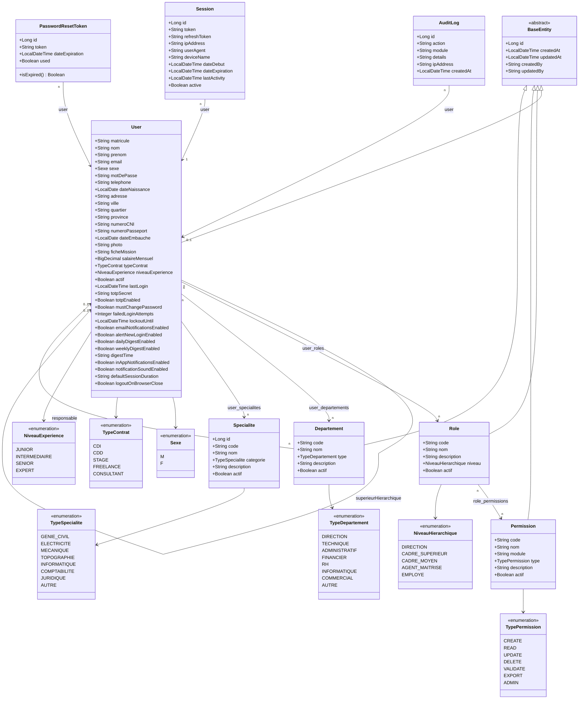

# Diagramme de Classes — 01 · Utilisateurs & Authentification

## Tables DB

| Entité | Table |
|--------|-------|
| User | `users` |
| Role | `roles` |
| Permission | `permissions` |
| Departement | `departements` |
| Specialite | `specialites` |
| Session | `sessions` |
| PasswordResetToken | `password_reset_tokens` |
| AuditLog | `audit_logs` |

## Tables de jointure N:N

| Table | Relation |
|-------|----------|
| `user_roles` | User ↔ Role |
| `user_departements` | User ↔ Departement |
| `user_specialites` | User ↔ Specialite |
| `role_permissions` | Role ↔ Permission |
