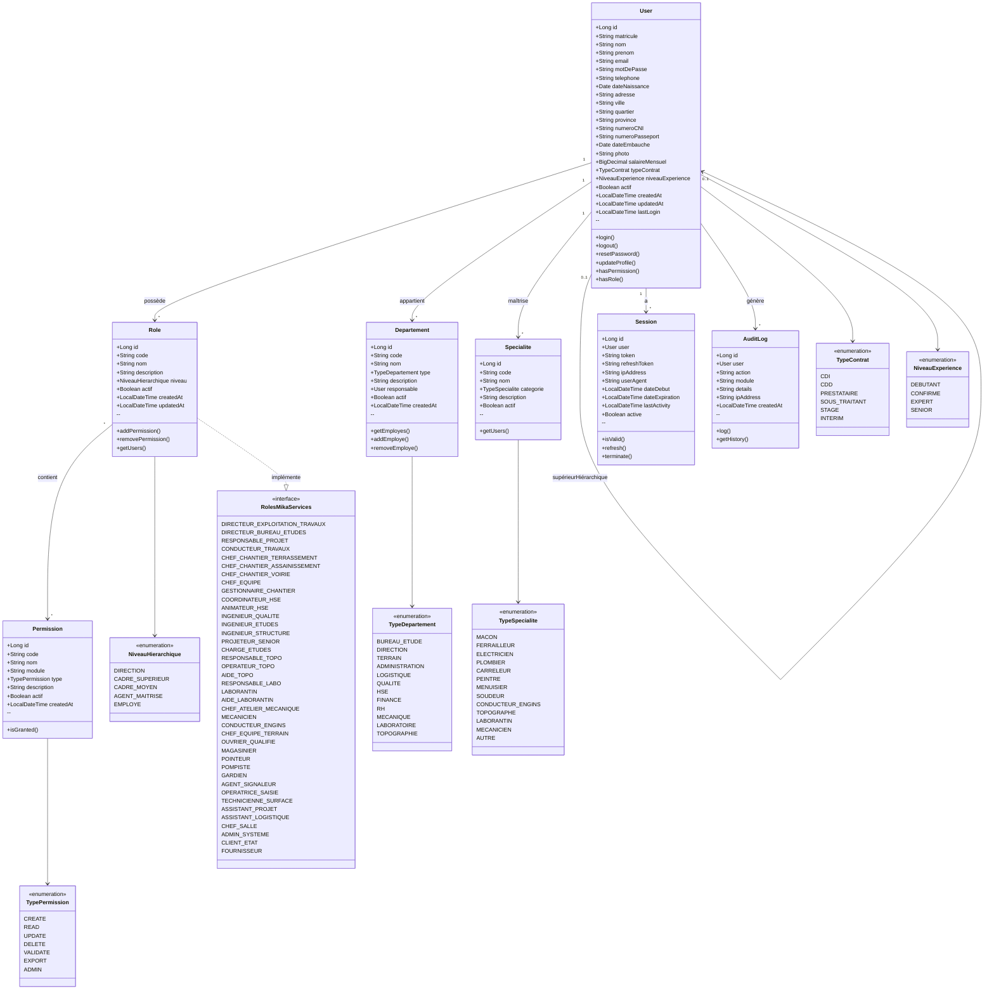

# DIAGRAMME DE CLASSES UML 1
## GESTION UTILISATEURS & AUTHENTIFICATION

---

## 📋 DESCRIPTION DES CLASSES

### **User (Utilisateur)**
Représente un employé ou utilisateur du système MIKA SERVICES.

**Attributs principaux :**
- `matricule` : Code unique (ex: EMP-2024-001)
- `nom`, `prenom`, `email`, `telephone` : Informations personnelles
- `dateNaissance`, `adresse`, `ville`, `quartier`, `province` : Coordonnées complètes
- `numeroCNI`, `numeroPasseport` : Documents d'identité
- `dateEmbauche` : Date d'entrée dans l'entreprise
- `salaireMensuel` : Salaire pour calculs budgétaires main d'œuvre
- `typeContrat` : CDI, CDD, Prestataire, etc.
- `niveauExperience` : Débutant, Confirmé, Expert
- `photo` : URL de la photo de profil

**Méthodes :**
- `login()` : Authentification
- `hasPermission()` : Vérifier si l'utilisateur a une permission spécifique
- `hasRole()` : Vérifier si l'utilisateur a un rôle spécifique

---

### **Role (Rôle)**
Définit les rôles utilisateurs avec niveau hiérarchique.

**Attributs :**
- `code` : Code unique (ex: CONDUCTEUR_TRAVAUX)
- `nom` : Nom du rôle
- `niveau` : Position hiérarchique (Direction, Cadre, Employé)

**Rôles identifiés selon organigrammes MIKA SERVICES :**
- Direction : Directeur Exploitation, Directeur Bureau d'Études
- Projets : Responsable Projet, Conducteur Travaux
- Chantier : Chef Chantier (Terrassement, Assainissement, Voirie)
- Terrain : Chef Équipe, Ouvriers, Conducteurs engins
- Support : HSE, Qualité, Topo, Labo, Mécanique

---

### **Permission (Permission)**
Définit les permissions granulaires par module.

**Types de permissions :**
- `CREATE` : Créer des enregistrements
- `READ` : Consulter des données
- `UPDATE` : Modifier des enregistrements
- `DELETE` : Supprimer des enregistrements
- `VALIDATE` : Valider des processus
- `EXPORT` : Exporter des données
- `ADMIN` : Administration complète

**Modules concernés :**
- PROJETS, CHANTIERS, BUDGET, QUALITE, SECURITE, MATERIEL, ENGINS, PLANNING, COMMUNICATION, REPORTING

---

### **Departement (Département)**
Organisationnel au sein de MIKA SERVICES.

**Types de départements :**
- Bureau d'Études
- Direction
- Terrain (Chantiers)
- Administration
- Logistique
- Qualité
- HSE (Santé Sécurité Environnement)
- Finance
- RH
- Mécanique
- Laboratoire
- Topographie

---

### **Specialite (Spécialité)**
Métiers/compétences techniques des ouvriers.

**Catégories :**
- Maçon, Ferrailleur, Électricien, Plombier
- Carreleur, Peintre, Menuisier, Soudeur
- Conducteur d'engins
- Topographe, Laborantin, Mécanicien

---

### **Session (Session utilisateur)**
Gestion des sessions actives pour sécurité.

**Attributs :**
- `token` : JWT token d'authentification
- `refreshToken` : Token de renouvellement
- `dateExpiration` : Date d'expiration
- `ipAddress`, `userAgent` : Traçabilité connexion

---

### **AuditLog (Journal d'audit)**
Traçabilité de toutes les actions critiques.

**Utilité :**
- Conformité réglementaire
- Investigation incidents
- Suivi des modifications budgétaires
- Historique validations

---

## 🔐 SÉCURITÉ & BONNES PRATIQUES

1. **Mots de passe** : Hashage BCrypt avec salt
2. **Tokens JWT** : Expiration courte (15 min) + refresh token (7 jours)
3. **Permissions granulaires** : RBAC (Role-Based Access Control)
4. **Audit complet** : Traçabilité de toutes actions sensibles
5. **Sessions multiples** : Un utilisateur peut avoir plusieurs sessions (web, mobile)
6. **Hiérarchie** : Relation `supérieurHiérarchique` pour workflow validations

---

## 📊 CARDINALITÉS

- **User ↔ Role** : `*-*` (Un utilisateur peut avoir plusieurs rôles)
- **User ↔ Departement** : `*-*` (Multi-affectation possible)
- **User ↔ Specialite** : `*-*` (Plusieurs compétences)
- **User ↔ User** : `0..1-0..1` (Supérieur hiérarchique)
- **Role ↔ Permission** : `*-*` (Un rôle contient plusieurs permissions)

---

**DATE DE CRÉATION** : 07/02/2026
**VERSION** : 1.0
**PROJET** : Plateforme Digitale MIKA SERVICES
