# DIAGRAMME DE CLASSES UML 2
## GESTION PROJETS/MARCHÉS & ORGANISATION

```mermaid
classDiagram
    %% ========================================
    %% ENTITÉS PRINCIPALES
    %% ========================================
    
    class Projet {
        +Long id
        +String codeProjet
        +String numeroMarche
        +String nom
        +String description
        +TypeProjet type
        +StatutProjet statut
        +Client client
        +SourceFinancement sourceFinancement
        +String imputationBudgetaire
        +String province
        +String ville
        +String quartier
        +BigDecimal montantHT
        +BigDecimal montantTTC
        +BigDecimal montantInitial
        +BigDecimal montantRevise
        +Integer delaiMois
        +Date dateDebut
        +Date dateFin
        +Date dateDebutReel
        +Date dateFinReelle
        +Float avancementGlobal
        +User responsableProjet
        +String partenairePrincipal
        +Boolean actif
        +LocalDateTime createdAt
        +LocalDateTime updatedAt
        --
        +calculerAvancementGlobal()
        +calculerBudgetConsomme()
        +calculerDelaiConsomme()
        +ajouterSousProjet()
        +genererSituation()
        +getPointsBloquants()
    }
    
    class SousProjet {
        +Long id
        +Projet projet
        +String code
        +String nom
        +String description
        +TypeTravaux typeTravaux
        +StatutSousProjet statut
        +BigDecimal montantHT
        +BigDecimal montantTTC
        +Integer delaiMois
        +Date dateDebut
        +Date dateFin
        +Float avancementPhysique
        +User responsable
        +LocalDateTime createdAt
        +LocalDateTime updatedAt
        --
        +calculerAvancement()
        +ajouterChantier()
    }
    
    class Client {
        +Long id
        +String code
        +String nom
        +TypeClient type
        +String ministere
        +String telephone
        +String email
        +String adresse
        +String contactPrincipal
        +String telephoneContact
        +Boolean actif
        +LocalDateTime createdAt
        --
        +getProjets()
    }
    
    class Partenaire {
        +Long id
        +String code
        +String nom
        +TypePartenaire type
        +String pays
        +String telephone
        +String email
        +String adresse
        +String contactPrincipal
        +Boolean actif
        +LocalDateTime createdAt
        --
        +getProjets()
    }
    
    class CAPrevisionnelRealise {
        +Long id
        +Projet projet
        +Integer mois
        +Integer annee
        +BigDecimal caPrevisionnel
        +BigDecimal caRealise
        +BigDecimal ecart
        +Float avancementCumule
        +LocalDateTime createdAt
        --
        +calculerEcart()
    }
    
    class PointBloquant {
        +Long id
        +Projet projet
        +String titre
        +String description
        +Priorite priorite
        +StatutPointBloquant statut
        +User detectePar
        +User assigneA
        +Date dateDetection
        +Date dateResolution
        +String actionCorrective
        +LocalDateTime createdAt
        +LocalDateTime updatedAt
        --
        +resoudre()
        +escalader()
    }
    
    class Prevision {
        +Long id
        +Projet projet
        +Integer semaine
        +Integer annee
        +String description
        +TypePrevision type
        +Date dateDebut
        +Date dateFin
        +StatutPrevision statut
        +LocalDateTime createdAt
        --
        +valider()
    }
    
    class RevisionBudget {
        +Long id
        +Projet projet
        +BigDecimal ancienMontant
        +BigDecimal nouveauMontant
        +String motif
        +Date dateRevision
        +User validepar
        +LocalDateTime createdAt
        --
        +appliquer()
    }
    
    %% ========================================
    %% ENUMERATIONS
    %% ========================================
    
    class TypeProjet {
        <<enumeration>>
        VOIRIE
        PONT
        BATIMENT
        ASSAINISSEMENT
        TERRASSEMENT
        MIXTE
        GENIE_CIVIL
        REHABILITATION
        AMENAGEMENT
    }
    
    class StatutProjet {
        <<enumeration>>
        EN_ATTENTE
        PLANIFIE
        EN_COURS
        SUSPENDU
        TERMINE
        ABANDONNE
        RECEPTION_PROVISOIRE
        RECEPTION_DEFINITIVE
    }
    
    class TypeClient {
        <<enumeration>>
        ETAT_GABON
        MINISTERE
        COLLECTIVITE
        ENTREPRISE_PUBLIQUE
        ENTREPRISE_PRIVEE
        PARTICULIER
    }
    
    class SourceFinancement {
        <<enumeration>>
        ETAT_GABONAIS
        BGFIBANK
        BAD
        BM
        AFD
        PARTENARIAT_PUBLIC_PRIVE
        FONDS_PROPRES
        MIXTE
    }
    
    class TypePartenaire {
        <<enumeration>>
        SOUS_TRAITANT
        CO_TRAITANT
        FOURNISSEUR_STRATEGIQUE
        BUREAU_CONTROLE
        PARTENAIRE_TECHNIQUE
    }
    
    class TypeTravaux {
        <<enumeration>>
        TERRASSEMENT
        VOIRIE
        ASSAINISSEMENT
        GENIE_CIVIL
        BATIMENT
        PONT
        OUVRAGE_ART
        AMENAGEMENT
        REHABILITATION
    }
    
    class StatutSousProjet {
        <<enumeration>>
        PLANIFIE
        EN_COURS
        TERMINE
        SUSPENDU
    }
    
    class Priorite {
        <<enumeration>>
        BASSE
        NORMALE
        HAUTE
        CRITIQUE
        URGENTE
    }
    
    class StatutPointBloquant {
        <<enumeration>>
        OUVERT
        EN_COURS
        RESOLU
        FERME
        ESCALADE
    }
    
    class TypePrevision {
        <<enumeration>>
        HEBDOMADAIRE
        MENSUELLE
        TRIMESTRIELLE
        PRODUCTION
        APPROVISIONNEMENT
        RESSOURCES_HUMAINES
        MATERIEL
    }
    
    class StatutPrevision {
        <<enumeration>>
        BROUILLON
        VALIDEE
        REALISEE
        ANNULEE
    }
    
    %% ========================================
    %% PROJETS RÉELS MIKA SERVICES (EXEMPLES)
    %% ========================================
    
    class ProjetsReelsMikaServices {
        <<interface>>
        AKEMIDJOGONI_VOIRIES
        LYCEE_CHARLES_INTERNAT
        USTM_REHABILITATION
        VOIRIES_LALALA
        VOIE_BEL_AIR
        PONT_CAMP_DEGAULLE
        VOIRIES_CAMP_DEGAULLE
        BASSIN_GUE_GUE
        MARCHE_OWENDO
        PONTS_LOUETSI_BONGOLO
        VOIRIES_KANGO
        LOWE_BERGE
        GARE_LAMBARENE
        GABOIL_EXTENSION
        ENA_REHABILITATION
        EPCA_REHABILITATION
        CARREFOUR_CHARBONNAGES
        VOIE_EXPRESS_OWENDO
        CTRI_KANGO
        NKOLTANG_VOIE_ACCES
    }
    
    %% ========================================
    %% RELATIONS
    %% ========================================
    
    Projet "1" --> "*" SousProjet : contient
    Projet "*" --> "1" Client : commandé par
    Projet "*" --> "*" Partenaire : collabore avec
    Projet "1" --> "1" User : responsable
    Projet "1" --> "*" CAPrevisionnelRealise : suit
    Projet "1" --> "*" PointBloquant : a
    Projet "1" --> "*" Prevision : planifie
    Projet "1" --> "*" RevisionBudget : peut avoir
    
    SousProjet "*" --> "1" User : responsable
    
    PointBloquant "*" --> "1" User : détecté par
    PointBloquant "*" --> "0..1" User : assigné à
    
    Projet --> TypeProjet
    Projet --> StatutProjet
    Projet --> SourceFinancement
    Client --> TypeClient
    Partenaire --> TypePartenaire
    SousProjet --> TypeTravaux
    SousProjet --> StatutSousProjet
    PointBloquant --> Priorite
    PointBloquant --> StatutPointBloquant
    Prevision --> TypePrevision
    Prevision --> StatutPrevision
    
    Projet ..|> ProjetsReelsMikaServices : exemples

```



---

## 📋 DESCRIPTION DES CLASSES

### **Projet (Projet/Marché)**
Représente un marché/projet attribué à MIKA SERVICES.

**Attributs principaux :**
- `codeProjet` : Code interne (ex: PRJ-GDL-2024)
- `numeroMarche` : Numéro officiel marché (ex: N°148/MTP/SG/2024)
- `nom` : Nom du projet (ex: "Construction pont Camp De Gaulle")
- `client` : Maître d'ouvrage (État, Ministère, Entreprise)
- `montantHT` / `montantTTC` : Montants contractuels
- `montantInitial` / `montantRevise` : Gestion révisions budgétaires
- `delaiMois` : Délai contractuel en mois
- `dateDebut` / `dateFin` : Dates prévues
- `dateDebutReel` / `dateFinReelle` : Dates réelles
- `avancementGlobal` : % d'avancement global du projet
- `responsableProjet` : Chef de projet (ex: Gabriel ONDO MVONO, Yves DITENGOU)
- `partenairePrincipal` : Partenaire principal (ex: NGE Contracting)
- `imputationBudgetaire` : Ligne budgétaire État (ex: 64.15.591.3-5.A2.R6)

**Méthodes importantes :**
- `calculerAvancementGlobal()` : Calcul basé sur sous-projets/chantiers
- `calculerBudgetConsomme()` : Budget dépensé vs prévu
- `calculerDelaiConsomme()` : % délai écoulé
- `genererSituation()` : Créer facture mensuelle

**Exemples réels (PV S01-2026) :**
- Pont Camp De Gaulle : 14,8 Mds FCFA, 24 mois, avancement 30%
- Voiries Kango : 9,1 Mds FCFA, 24 mois
- Bassin Gué-Gué : 16 Mds FCFA, 24 mois
- Ponts LOUETSI-BONGOLO : 28,9 Mds FCFA, 36 mois

---

### **SousProjet (Sous-Projet)**
Division d'un projet en sous-ensembles.

**Exemple hiérarchie :**
```
PROJET : Grand-Libreville (100 Mds FCFA)
  └─ SOUS-PROJET 1 : Pont PK8 (15 Mds FCFA)
  └─ SOUS-PROJET 2 : Voirie Akanda (20 Mds FCFA)
  └─ SOUS-PROJET 3 : Assainissement Owendo (18 Mds FCFA)
```

**Attributs :**
- `code` : Numérotation automatique (PRJ-001-SP-01)
- `typeTravaux` : TERRASSEMENT, VOIRIE, PONT, etc.
- `montantHT` / `montantTTC` : Budget alloué
- `avancementPhysique` : % avancement physique

---

### **Client (Maître d'Ouvrage)**
Entité qui commande le projet.

**Types de clients MIKA SERVICES :**
- **ETAT_GABON** : État gabonais
- **MINISTERE** : Ministère des Travaux Publics, Ministère Éducation, etc.
- **ENTREPRISE_PUBLIQUE** : Société nationale
- **ENTREPRISE_PRIVEE** : Maurel & Prom, GABOIL

**Attributs :**
- `ministere` : Si client = Ministère (MTPC, MENFPFC)
- `contactPrincipal` : Interlocuteur principal

---

### **Partenaire (Sous-traitant/Co-traitant)**
Entreprise partenaire sur le projet.

**Exemples MIKA SERVICES :**
- NGE Contracting (Owendo Bypass)
- LSA (Location engins - filiale Groupe ACK)
- ATRICOM, LG2E (Fournisseurs)

**Types :**
- Sous-traitant
- Co-traitant
- Fournisseur stratégique
- Bureau de contrôle
- Partenaire technique

---

### **CAPrevisionnelRealise (CA Prévisionnel vs Réalisé)**
Suivi mensuel du chiffre d'affaires.

**Utilisation (PV Réunions) :**
```
Mois        | CA Prévisionnel | CA Réalisé | Écart | Avancement cumulé %
Oct-2025    | 500 M FCFA     | 480 M FCFA | -20 M | 10%
Nov-2025    | 600 M FCFA     | 620 M FCFA | +20 M | 22%
```

**Méthodes :**
- `calculerEcart()` : Écart = CA Réalisé - CA Prévisionnel

---

### **PointBloquant (Point Bloquant)**
Problème identifié empêchant l'avancement.

**Exemples réels (PV S01-2026) :**
- "Conduite en fonte sur Axe 3" (Akémidjogoni)
- "Transfo à déplacer sur l'emprise Axe 4"
- "Besoin d'une Niveleuse à temps plein"
- "Zone de déplacement fibre optique au risque de la détériorer" (Pont Camp De Gaulle)
- "Pas de conteneurs bureaux" (Voie Bel-Air)

**Attributs :**
- `priorite` : BASSE, NORMALE, HAUTE, CRITIQUE, URGENTE
- `statut` : OUVERT, EN_COURS, RESOLU, FERME, ESCALADE
- `actionCorrective` : Action à mener
- `dateResolution` : Date de résolution

**Workflow :**
1. Détection par Chef chantier/Conducteur
2. Assignation à responsable
3. Action corrective
4. Résolution ou escalade

---

### **Prevision (Prévision)**
Planification future (hebdomadaire, mensuelle).

**Exemples (PV S01-2026) :**

**Prévision S2 - Pont Camp De Gaulle :**
- 15 poutres de 19/90 soit 3/jours
- 20 corniches de type A
- 02 demi-chevêtres
- 10 pieux 800 - forés et coulés

**Prévision S2 - Akémidjogoni :**
- Décompte N°3
- Transmission documents MTPC pour validation DQE
- Délai d'exécution actualisé à communiquer

**Types :**
- HEBDOMADAIRE (Semaine 1, 2, etc.)
- MENSUELLE
- PRODUCTION (volumes à produire)
- APPROVISIONNEMENT (matériaux)
- RESSOURCES_HUMAINES (recrutement)
- MATERIEL (besoins engins)

---

### **RevisionBudget (Révision Budgétaire)**
Historique modifications budget projet.

**Cas d'usage :**
- Avenant au marché
- Travaux complémentaires
- Augmentation enveloppe

**Traçabilité :**
- `ancienMontant` / `nouveauMontant`
- `motif` : Raison de la révision
- `validepar` : Personne ayant validé

---

## 📊 CARDINALITÉS

- **Projet ↔ SousProjet** : `1-*` (Un projet contient plusieurs sous-projets)
- **Projet ↔ Client** : `*-1` (Plusieurs projets pour un même client)
- **Projet ↔ Partenaire** : `*-*` (Plusieurs partenaires possibles par projet)
- **Projet ↔ CAPrevisionnelRealise** : `1-*` (Suivi mensuel)
- **Projet ↔ PointBloquant** : `1-*` (Plusieurs points bloquants possibles)
- **Projet ↔ Prevision** : `1-*` (Plusieurs prévisions)

---

## 🎯 CAS D'USAGE RÉELS

### **Exemple 1 : Pont Camp De Gaulle**
```
PROJET
  Code: PRJ-PONT-CDG-2024
  Numéro Marché: N°148/MTP/SG/2024
  Nom: Construction pont carrefour Camp DEGAULLE
  Client: Ministère Travaux Publics
  Montant HT: 14.805.768.664 FCFA
  Délai: 24 mois
  Responsable: Yves DITENGOU
  Avancement: 30%
  Délai consommé: 37%
  
POINTS BLOQUANTS
  - Zone fibre optique à déplacer (URGENT)
  - Conduite SEEG Ø800 à déplacer
  - HT 20000V à déplacer côté ASSOUME N.
  
PREVISIONS S5 (02-07/02/2026)
  - 18 poutres 17/90 (3/jour)
  - 20 corniches type A
  - 9 pieux Ø1000 forés/coulés
  - Carrottage pieux C15-87 et C1-5
```

### **Exemple 2 : Bassin Gué-Gué**
```
PROJET
  Code: PRJ-GUE-GUE-2025
  Numéro Marché: N°…/MTPC/CAB-M/UCET/2025
  Nom: Aménagement Bassin Versant Gué-Gué
  Montant HT: 16.064.386.555 FCFA
  Délai: 24 mois
  Responsable: Ulrich Landry IBOUANA
  
PREVISION S2
  - Nettoyage emprise (jonction Gustave et Saoti)
  - Finalisation méthodologie
```

---

**DATE DE CRÉATION** : 07/02/2026
**VERSION** : 1.0
**PROJET** : Plateforme Digitale MIKA SERVICES
