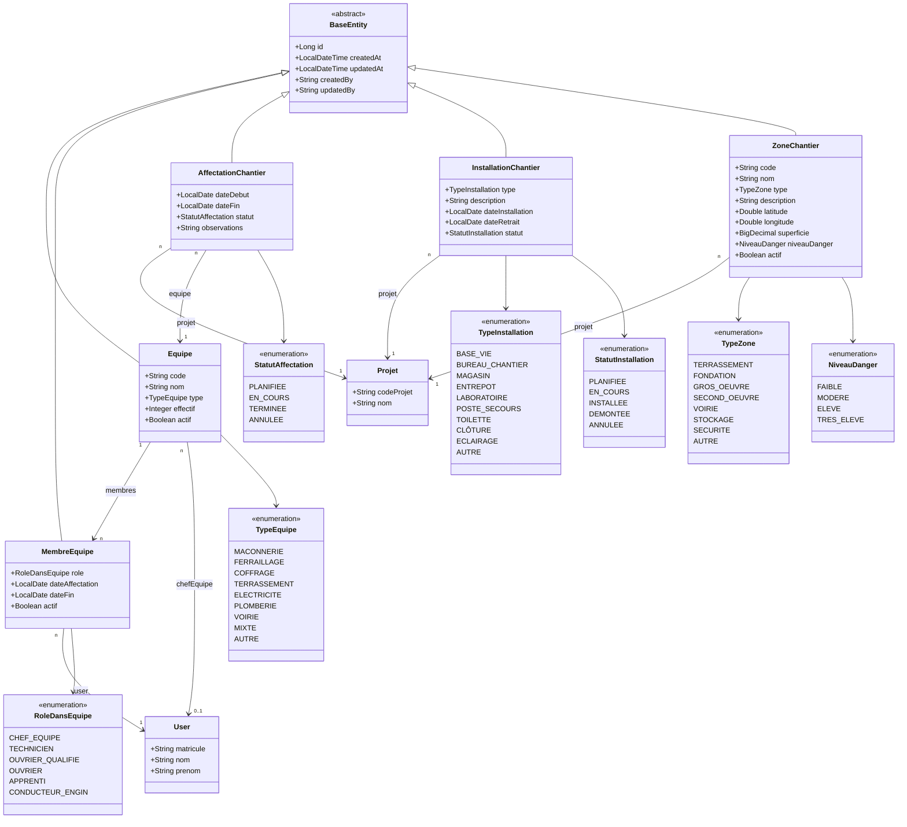

# Diagramme de Classes — 03 · Chantiers & Affectations

## Tables DB

| Entité | Table |
|--------|-------|
| Equipe | `equipes` |
| MembreEquipe | `membres_equipe` |
| AffectationChantier | `affectations_projet` |
| InstallationChantier | `installations_projet` |
| ZoneChantier | `zones_projet` |
