# DIAGRAMME DE CLASSES UML 3
## GESTION CHANTIERS & AFFECTATIONS

```mermaid
classDiagram
    %% ========================================
    %% ENTITÉS PRINCIPALES
    %% ========================================
    
    class Chantier {
        +Long id
        +SousProjet sousProjet
        +String code
        +String nom
        +String description
        +TypeChantier type
        +StatutChantier statut
        +String adresse
        +String quartier
        +String ville
        +String province
        +Double latitude
        +Double longitude
        +BigDecimal superficie
        +ConditionAcces conditionAcces
        +ZoneClimatique zoneClimatique
        +Double distanceDepotKm
        +Integer nombreOuvriersPrevu
        +String horaireTravail
        +Date dateDebut
        +Date dateFin
        +Date dateDebutReel
        +Date dateFinReelle
        +Float avancementPhysique
        +User chefChantier
        +Boolean actif
        +LocalDateTime createdAt
        +LocalDateTime updatedAt
        --
        +calculerAvancement()
        +ajouterEquipe()
        +affecter Engin()
        +affecterMateriau()
        +genererRapportQuotidien()
    }
    
    class Equipe {
        +Long id
        +String code
        +String nom
        +TypeEquipe type
        +User chefEquipe
        +Integer effectif
        +Boolean actif
        +LocalDateTime createdAt
        +LocalDateTime updatedAt
        --
        +ajouterMembre()
        +retirerMembre()
        +getChantiers()
        +getDisponibilite()
    }
    
    class MembreEquipe {
        +Long id
        +Equipe equipe
        +User user
        +RoleDansEquipe role
        +Date dateAffectation
        +Date dateFin
        +Boolean actif
        +LocalDateTime createdAt
        --
        +calculerAnciennete()
    }
    
    class AffectationChantier {
        +Long id
        +Chantier chantier
        +Equipe equipe
        +Date dateDebut
        +Date dateFin
        +StatutAffectation statut
        +String observations
        +LocalDateTime createdAt
        +LocalDateTime updatedAt
        --
        +terminer()
        +prolonger()
    }
    
    class AffectationEnginChantier {
        +Long id
        +Chantier chantier
        +Engin engin
        +Date dateDebut
        +Date dateFin
        +Integer heuresPrevues
        +Integer heuresReelles
        +StatutAffectation statut
        +String observations
        +LocalDateTime createdAt
        --
        +calculerHeuresUtilisees()
    }
    
    class AffectationMateriauChantier {
        +Long id
        +Chantier chantier
        +Materiau materiau
        +BigDecimal quantiteAffectee
        +Unite unite
        +Date dateAffectation
        +String observations
        +LocalDateTime createdAt
        --
        +getConsommation()
    }
    
    class ZoneChantier {
        +Long id
        +Chantier chantier
        +String code
        +String nom
        +TypeZone type
        +String description
        +Double latitude
        +Double longitude
        +BigDecimal superficie
        +NiveauDanger niveauDanger
        +Boolean actif
        +LocalDateTime createdAt
        --
        +marquerDangereuse()
    }
    
    class InstallationChantier {
        +Long id
        +Chantier chantier
        +TypeInstallation type
        +String description
        +Date dateInstallation
        +Date dateRetrait
        +StatutInstallation statut
        +LocalDateTime createdAt
        --
        +installer()
        +retirer()
    }
    
    %% ========================================
    %% ENUMERATIONS
    %% ========================================
    
    class TypeChantier {
        <<enumeration>>
        TERRASSEMENT
        VOIRIE
        ASSAINISSEMENT
        GENIE_CIVIL
        BATIMENT
        PONT
        OUVRAGE_ART
        AMENAGEMENT
        REHABILITATION
        FONDATIONS
        SUPERSTRUCTURE
    }
    
    class StatutChantier {
        <<enumeration>>
        PLANIFIE
        INSTALLATION
        EN_COURS
        SUSPENDU
        TERMINE
        RECEPTION_PROVISOIRE
        RECEPTION_DEFINITIVE
        ABANDONNE
    }
    
    class ConditionAcces {
        <<enumeration>>
        FACILE
        MOYEN
        DIFFICILE
        TRES_DIFFICILE
    }
    
    class ZoneClimatique {
        <<enumeration>>
        NORD
        SUD
        COTIER
        INTERIEUR
        ESTUAIRE
    }
    
    class TypeEquipe {
        <<enumeration>>
        TERRASSEMENT
        VOIRIE
        ASSAINISSEMENT
        GENIE_CIVIL
        BATIMENT
        PONT
        TOPOGRAPHIE
        LABORATOIRE
        MECANIQUE
        POLYVALENTE
    }
    
    class RoleDansEquipe {
        <<enumeration>>
        CHEF_EQUIPE
        CHEF_EQUIPE_ADJOINT
        OUVRIER_QUALIFIE
        OUVRIER_SPECIALISE
        MANOEUVRE
        APPRENTI
    }
    
    class StatutAffectation {
        <<enumeration>>
        PLANIFIEE
        EN_COURS
        TERMINEE
        ANNULEE
        SUSPENDUE
    }
    
    class TypeZone {
        <<enumeration>>
        ZONE_TRAVAUX
        ZONE_STOCKAGE
        ZONE_PREFABRICATION
        ZONE_BUREAUX
        ZONE_BASE_VIE
        ZONE_DANGEREUSE
        ZONE_INTERDIT
    }
    
    class NiveauDanger {
        <<enumeration>>
        FAIBLE
        MOYEN
        ELEVE
        TRES_ELEVE
    }
    
    class TypeInstallation {
        <<enumeration>>
        BUREAU_CHANTIER
        CONTENEUR
        BARAQUE
        BASE_VIE
        CLOTURE
        SIGNALISATION
        AIRE_STOCKAGE
        CENTRALE_BETON
        ATELIER_MECANIQUE
        AIRE_PREFABRICATION
        SANITAIRES
        GROUPE_ELECTROGENE
    }
    
    class StatutInstallation {
        <<enumeration>>
        PLANIFIEE
        EN_COURS_INSTALLATION
        INSTALLEE
        EN_SERVICE
        EN_DEMONTAGE
        RETIREE
    }
    
    %% ========================================
    %% RELATIONS
    %% ========================================
    
    Chantier "*" --> "1" SousProjet : fait partie de
    Chantier "1" --> "0..1" User : chef chantier
    Chantier "1" --> "*" AffectationChantier : a
    Chantier "1" --> "*" AffectationEnginChantier : utilise
    Chantier "1" --> "*" AffectationMateriauChantier : consomme
    Chantier "1" --> "*" ZoneChantier : divisé en
    Chantier "1" --> "*" InstallationChantier : possède
    
    Equipe "1" --> "1" User : chef équipe
    Equipe "1" --> "*" MembreEquipe : composée de
    Equipe "1" --> "*" AffectationChantier : affectée à
    
    MembreEquipe "*" --> "1" User : membre
    
    AffectationChantier "*" --> "1" Chantier
    AffectationChantier "*" --> "1" Equipe
    
    AffectationEnginChantier "*" --> "1" Chantier
    AffectationEnginChantier "*" --> "1" Engin
    
    AffectationMateriauChantier "*" --> "1" Chantier
    AffectationMateriauChantier "*" --> "1" Materiau
    
    ZoneChantier "*" --> "1" Chantier
    
    InstallationChantier "*" --> "1" Chantier
    
    Chantier --> TypeChantier
    Chantier --> StatutChantier
    Chantier --> ConditionAcces
    Chantier --> ZoneClimatique
    Equipe --> TypeEquipe
    MembreEquipe --> RoleDansEquipe
    AffectationChantier --> StatutAffectation
    AffectationEnginChantier --> StatutAffectation
    ZoneChantier --> TypeZone
    ZoneChantier --> NiveauDanger
    InstallationChantier --> TypeInstallation
    InstallationChantier --> StatutInstallation

```



---

## 📋 DESCRIPTION DES CLASSES

### **Chantier (Chantier)**
Zone de travaux d'un sous-projet.

**Hiérarchie complète :**
```
PROJET : Grand-Libreville (100 Mds FCFA)
  └─ SOUS-PROJET : Pont PK8 (15 Mds FCFA)
       └─ CHANTIER 1 : Fondations Pont (5 Mds FCFA)
       └─ CHANTIER 2 : Superstructure Pont (7 Mds FCFA)
       └─ CHANTIER 3 : Voirie d'accès (3 Mds FCFA)
```

**Attributs principaux :**
- `code` : Code unique (ex: CHT-PONT-PK8-F01)
- `type` : TERRASSEMENT, VOIRIE, ASSAINISSEMENT, PONT, etc.
- `statut` : PLANIFIE, INSTALLATION, EN_COURS, TERMINE, etc.
- `adresse`, `quartier`, `ville`, `province` : Localisation complète
- `latitude`, `longitude` : Géolocalisation GPS
- `superficie` : Surface en m²
- `conditionAcces` : FACILE, DIFFICILE, TRES_DIFFICILE
- `zoneClimatique` : Impact saison des pluies
- `distanceDepotKm` : Distance depuis dépôt central (pour calcul transport)
- `nombreOuvriersPrevu` : Dimensionnement ressources
- `horaireTravail` : Ex: "07h00-17h00" ou horaires variables
- `avancementPhysique` : % d'avancement physique
- `chefChantier` : Responsable (ex: NDONG ONGUIE Justin pour Voiries Kango)

**Méthodes :**
- `calculerAvancement()` : Basé sur tâches terminées
- `ajouterEquipe()` : Affecter une équipe
- `affecterEngin()` : Affecter un engin (pelleteuse, niveleuse, etc.)
- `affecterMateriau()` : Allouer des matériaux au chantier

**Exemple réel (Organigramme VDK - Voiries de Kango) :**
```
CHANTIER : VOIRIES DE KANGO
  Responsable Projet: AWA NYARE Lewis
  Conducteur Travaux: NDONG ONGUIE Justin
  Chef Chantier Terrassement: MBA NZUE Nestor
  Chef Chantier Assainissement: À POURVOIR
  Gestionnaire Chantier: MAVIOKA ESSONGUE Eric, ONTSOMA Nicholas
  Coordinateur HSE: À POURVOIR
  Ingénieur Qualité: NGUEMA NDOUME Steve
```

---

### **Equipe (Équipe de Terrain)**
Groupe d'ouvriers dirigé par un chef d'équipe.

**Composition type (Organigramme VDK) :**
```
EQUIPE 01
  Chef d'équipe: IGONDJO Wilfried
  Ouvriers qualifiés: 5-10 personnes
  Manœuvres: 3-5 personnes
  
EQUIPE 02
  Chef d'équipe: MBOUMBA Thierry
  
EQUIPE 03
  Chef d'équipe: À POURVOIR
```

**Attributs :**
- `code` : Code unique (ex: EQ-TERR-01)
- `nom` : Nom de l'équipe
- `type` : TERRASSEMENT, VOIRIE, ASSAINISSEMENT, GENIE_CIVIL, etc.
- `chefEquipe` : Chef d'équipe (User)
- `effectif` : Nombre total de membres

**Types d'équipes :**
- **Terrassement** : Déblai, remblai, nivellement
- **Voirie** : Pose enrobés, bordures, caniveaux
- **Assainissement** : Réseaux EP/EU, regards
- **Génie Civil** : Béton armé, coffrage, ferraillage
- **Pont** : Spécialistes ouvrages d'art
- **Topographie** : Mesures, implantation
- **Laboratoire** : Essais matériaux
- **Mécanique** : Maintenance engins
- **Polyvalente** : Multi-tâches

**Contrainte métier :**
Une équipe peut être affectée à **plusieurs chantiers** en rotation (selon besoins).

---

### **MembreEquipe (Membre d'Équipe)**
Lien entre un User et une Equipe.

**Rôles dans l'équipe :**
- **CHEF_EQUIPE** : Responsable équipe
- **CHEF_EQUIPE_ADJOINT** : Adjoint
- **OUVRIER_QUALIFIE** : Compétence reconnue (maçon, ferrailleur)
- **OUVRIER_SPECIALISE** : Spécialité pointue (soudeur, électricien)
- **MANOEUVRE** : Aide générale
- **APPRENTI** : En formation

**Attributs :**
- `dateAffectation` : Date d'intégration à l'équipe
- `dateFin` : Date de sortie (si rotation)

---

### **AffectationChantier (Affectation Équipe → Chantier)**
Lien entre une équipe et un chantier sur une période.

**Exemple :**
```
EQUIPE : EQ-TERR-01 (Chef: IGONDJO Wilfried)
CHANTIER : Voiries Kango - Terrassement Axe 1
PERIODE : 01/12/2025 → 31/03/2026
STATUT : EN_COURS
```

**Workflow :**
1. Planification affectation
2. Début travaux (statut = EN_COURS)
3. Fin travaux (statut = TERMINEE)
4. Possibilité de prolongation

**Contrainte métier :**
Une équipe peut être affectée à plusieurs chantiers en parallèle si besoin (rotation quotidienne/hebdomadaire).

---

### **AffectationEnginChantier (Affectation Engin → Chantier)**
Allocation d'un engin à un chantier sur une période.

**Exemples d'engins (Organigramme VDK) :**
- Pelleteuses
- Bulldozers
- Niveleuses
- Compacteurs
- Camions
- Bétonnières
- Grues

**Attributs :**
- `heuresPrevues` : Heures d'utilisation prévues
- `heuresReelles` : Heures réellement utilisées
- `statut` : PLANIFIEE, EN_COURS, TERMINEE

**Cas d'usage (PV S01-2026) :**
```
CHANTIER : Voirie Bel-Air
POINT BLOQUANT : "Besoin d'une Niveleuse à temps plein"
→ Affectation Niveleuse en priorité
```

**Contrainte métier :**
Un engin peut être affecté à plusieurs chantiers (rotation selon planning).

---

### **AffectationMateriauChantier (Affectation Matériau → Chantier)**
Allocation de matériaux à un chantier.

**Exemples matériaux :**
- Ciment
- Sable
- Gravier
- Fer à béton
- Enrobés
- Bordures préfabriquées

**Attributs :**
- `quantiteAffectee` : Quantité allouée
- `unite` : TONNE, M3, M2, SAC, UNITE

**Exemple (PV S01-2026 - Pont Camp De Gaulle) :**
```
BESOIN S5
  - Sable : 4 camions/jour
  - Ciment vrac : tous les 3 jours
  - Agrégats AVANTIS : livraison
  - 0/25 : 150 tonnes (reste commande DA n°028057)
```

**Méthode :**
- `getConsommation()` : Quantité consommée vs affectée

---

### **ZoneChantier (Zone de Chantier)**
Division d'un chantier en zones fonctionnelles.

**Types de zones :**
- **ZONE_TRAVAUX** : Zone active de production
- **ZONE_STOCKAGE** : Stockage matériaux
- **ZONE_PREFABRICATION** : Préfabrication éléments (poutres, corniches)
- **ZONE_BUREAUX** : Bureaux de chantier
- **ZONE_BASE_VIE** : Hébergement équipes
- **ZONE_DANGEREUSE** : Zone à risque (excavation profonde, zone inondable)
- **ZONE_INTERDIT** : Accès interdit au personnel

**Niveau de danger :**
- FAIBLE
- MOYEN
- ELEVE
- TRES_ELEVE

**Utilité sécurité :**
Identification zones dangereuses pour prévention accidents.

---

### **InstallationChantier (Installation de Chantier)**
Infrastructure temporaire installée sur le chantier.

**Types d'installations :**
- **BUREAU_CHANTIER** : Bureau chef de chantier/conducteur
- **CONTENEUR** : Conteneur bureau/stockage
- **BASE_VIE** : Hébergement ouvriers
- **CLOTURE** : Sécurisation périmètre
- **SIGNALISATION** : Panneaux signalétique chantier
- **AIRE_STOCKAGE** : Zone stockage matériaux
- **CENTRALE_BETON** : Production béton sur site
- **ATELIER_MECANIQUE** : Maintenance engins
- **AIRE_PREFABRICATION** : Préfabrication éléments (poutres, etc.)
- **SANITAIRES** : WC, douches
- **GROUPE_ELECTROGENE** : Alimentation électrique

**Exemple (PV S01-2026 - Voie Bel-Air) :**
```
POINT BLOQUANT
  - "Pas de conteneurs bureaux"
→ Installation urgente de conteneurs bureaux
```

**Statuts :**
- PLANIFIEE
- EN_COURS_INSTALLATION
- INSTALLEE
- EN_SERVICE
- EN_DEMONTAGE
- RETIREE

---

## 📊 CARDINALITÉS

- **Chantier ↔ SousProjet** : `*-1` (Plusieurs chantiers par sous-projet)
- **Chantier ↔ User (chef)** : `1-0..1` (Un chef de chantier unique)
- **Chantier ↔ AffectationChantier** : `1-*` (Plusieurs équipes possibles)
- **Chantier ↔ AffectationEnginChantier** : `1-*` (Plusieurs engins)
- **Chantier ↔ AffectationMateriauChantier** : `1-*` (Plusieurs matériaux)
- **Chantier ↔ ZoneChantier** : `1-*` (Division en zones)
- **Chantier ↔ InstallationChantier** : `1-*` (Plusieurs installations)
- **Equipe ↔ MembreEquipe** : `1-*` (Plusieurs membres)
- **Equipe ↔ AffectationChantier** : `1-*` (Une équipe peut être affectée à plusieurs chantiers)

---

## 🎯 CAS D'USAGE RÉEL

### **Chantier Voiries de Kango (Organigramme VDK)**

```
CHANTIER : VOIRIES DE KANGO
  Code : CHT-KANGO-VDK-2025
  Type : VOIRIE
  Statut : EN_COURS
  Chef Chantier Terrassement : MBA NZUE Nestor
  Chef Chantier Assainissement : À POURVOIR
  Coordinateur HSE : À POURVOIR
  
EQUIPES AFFECTEES
  Équipe 01 : Chef IGONDJO Wilfried
  Équipe 02 : Chef MBOUMBA Thierry
  Équipe 03 : Chef à pourvoir
  
PERSONNEL SUPPORT
  Conducteurs d'engins : MOULAMBA Benjamin, NTSIGA Joachim, MEBALE Franck
  Chef atelier mécanique : KOUMBI M. MICK
  Responsable Topo : MEGNE Gustave
  Opérateurs topo : MEBALE RENAMY Wilfrid
  Responsable Labo : MAVOCHY Wilfried
  Laborantins : MOUBOUADA Robert, BIE NZAMBA Boris
  Ingénieur Qualité : NGUEMA NDOUME Steve
  Animateurs HSE : AHENGOUENET Cyrille, BOULINGUI Hanse
  Gestionnaires : MAVIOKA ESSONGUE Eric, ONTSOMA Nicholas
  Magasiniers : ...
  Pointeurs : ...
  Gardiens : ENGOULOU David, AYENG Ravela
  
INSTALLATIONS
  - Bureaux chantier
  - Base vie
  - Aire stockage matériaux
  - Atelier mécanique
  - Laboratoire
```

---

**DATE DE CRÉATION** : 07/02/2026
**VERSION** : 1.0
**PROJET** : Plateforme Digitale MIKA SERVICES
