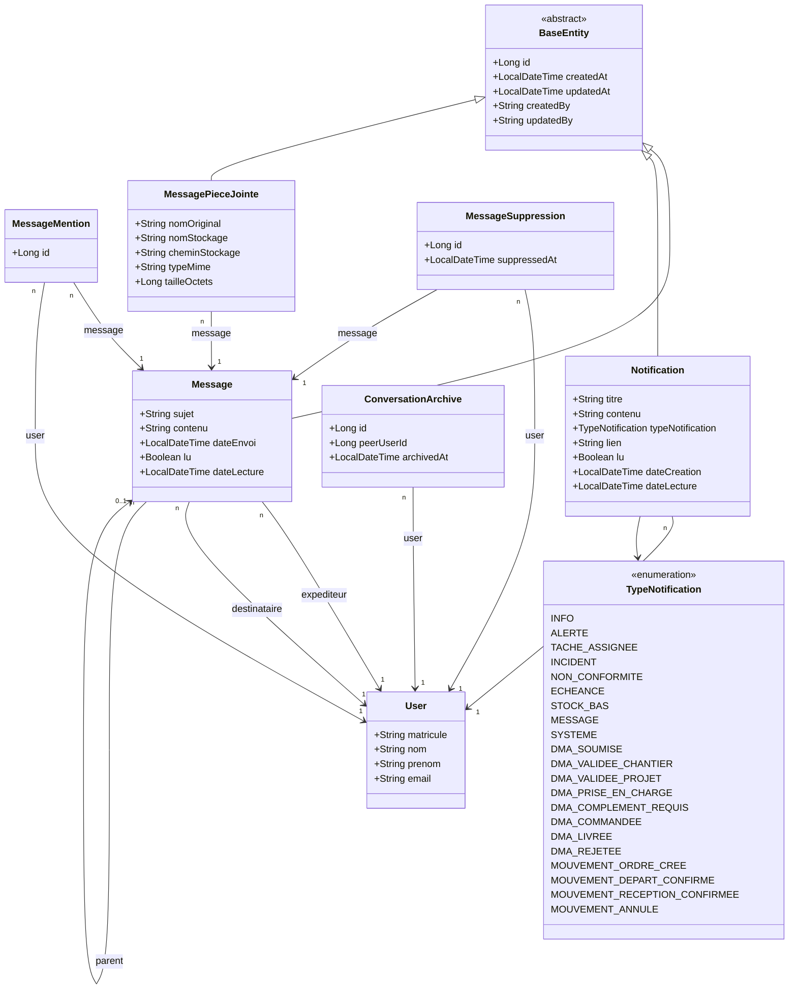

# Diagramme de Classes — 04 · Communication & Messagerie

## Tables DB

| Entité | Table |
|--------|-------|
| Message | `messages` |
| Notification | `notifications` |
| MessageMention | `message_mentions` |
| MessagePieceJointe | `message_pieces_jointes` |
| MessageSuppression | `message_suppressions` |
| ConversationArchive | `conversation_archives` |

## Règles métier

- Un `Message` peut avoir un `parent` (réponse → thread de conversation).
- `MessageSuppression` : suppression "pour moi" uniquement (l'autre utilisateur voit toujours le message).
- `ConversationArchive` : archive une conversation entre deux utilisateurs (user ↔ peerUserId).
- `MessageMention` : l'utilisateur est mentionné dans le corps du message (`@user`).
