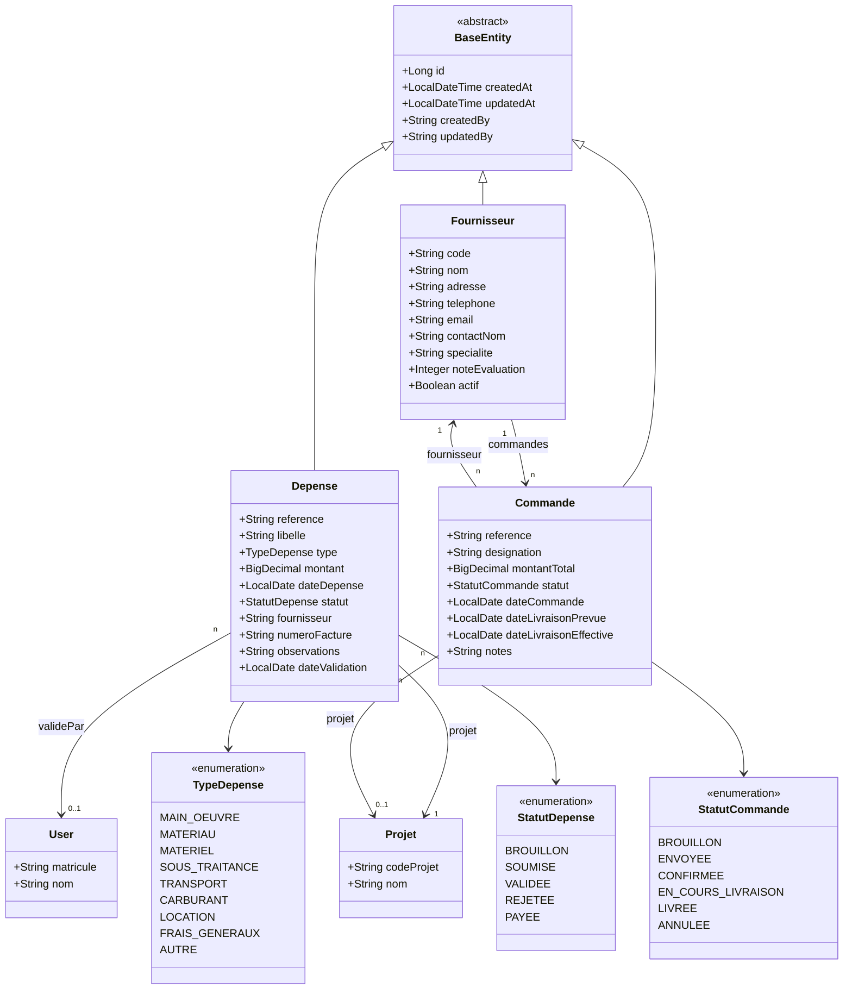

# Diagramme de Classes — 08 · Budget, Fournisseurs & Commandes



## Tables DB

| Entité | Table |
|--------|-------|
| Depense | `depenses` |
| Fournisseur | `fournisseurs` |
| Commande | `commandes` |

## Machine à états Depense

```
BROUILLON → SOUMISE → VALIDEE → PAYEE
                    → REJETEE
```

## Machine à états Commande

```
BROUILLON → ENVOYEE → CONFIRMEE → EN_COURS_LIVRAISON → LIVREE
          → ANNULEE (depuis tout statut)
```

## Lien avec DMA

La `Commande` est liée à une `DemandeMateriel` (champ `commande` sur l'entité DemandeMateriel). Quand une DMA passe au statut `EN_COMMANDE`, une commande fournisseur peut être associée.
