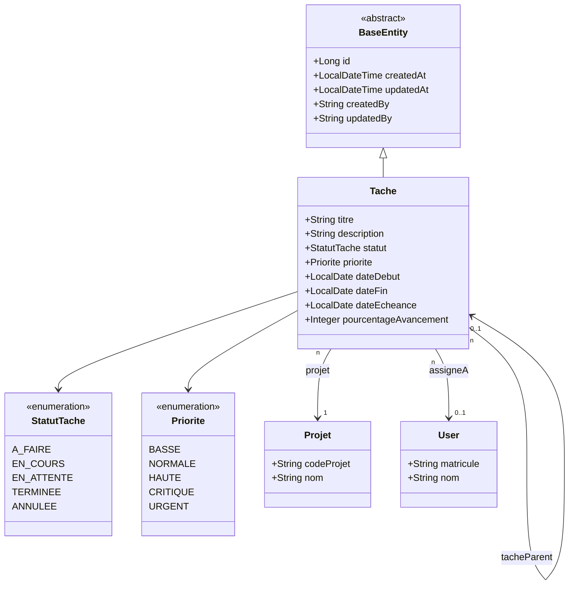

# Diagramme de Classes — 09 · Planning & Tâches



## Tables DB

| Entité | Table |
|--------|-------|
| Tache | `taches` |

## Points clés

- **Hiérarchie** : une `Tache` peut avoir un parent (`tacheParent`) pour modéliser des sous-tâches.
- **Avancement** : `pourcentageAvancement` (0–100%) mis à jour manuellement ou par agrégation des sous-tâches.
- **Priorité partagée** : l'enum `Priorite` est partagé avec `PointBloquant`.

## Machine à états Tache

```
A_FAIRE → EN_COURS → EN_ATTENTE → EN_COURS
        → EN_COURS → TERMINEE
        → ANNULEE (depuis tout statut)
```
