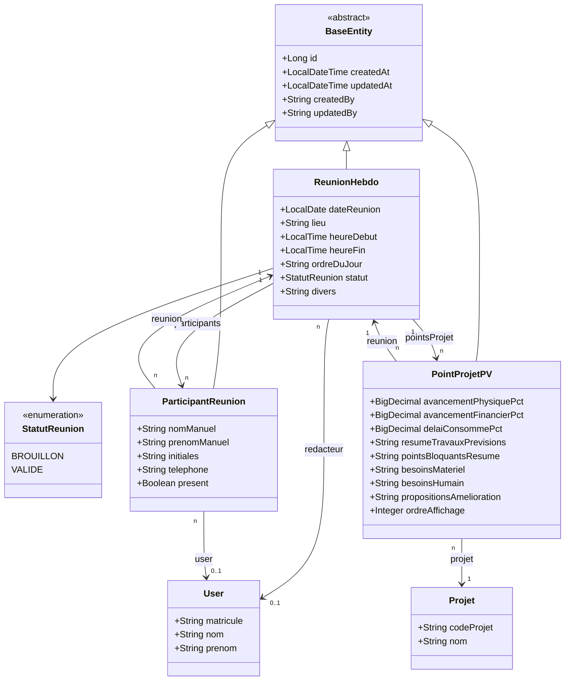

# Diagramme de Classes — 10 · Réunions Hebdomadaires & Procès-Verbaux

## Tables DB

| Entité | Table |
|--------|-------|
| ReunionHebdo | `reunions_hebdo` |
| ParticipantReunion | `participants_reunion` |
| PointProjetPV | `points_projet_pv` |

## Points clés

- **ParticipantReunion** : peut être un utilisateur inscrit (`user`) ou un participant externe (champs `nomManuel`, `prenomManuel`).
- **PointProjetPV** : un point de PV par projet par réunion (contrainte unique `reunion_id, projet_id`).
- **PointProjetPV** reprend les indicateurs d'avancement (physique, financier, délai) + commentaires.
- Le statut `VALIDE` verrouille la réunion et génère le PV officiel.
