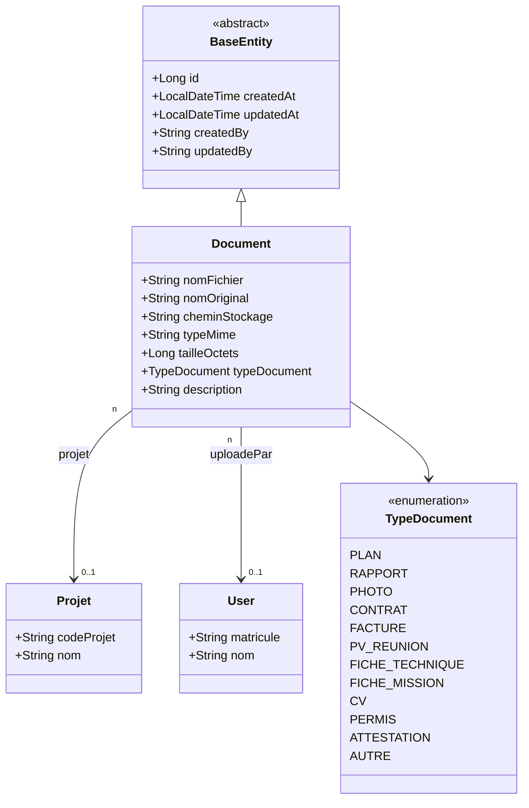

# Diagramme de Classes — 11 · Gestion Électronique des Documents (GED)

## Tables DB

| Entité | Table |
|--------|-------|
| Document | `documents` |

## Points clés

- Un document peut être lié à un projet (`projet`) ou être un document général (sans projet).
- `nomFichier` : nom unique en stockage (UUID-based). `nomOriginal` : nom d'origine côté utilisateur.
- `cheminStockage` : chemin absolu ou relatif selon la configuration du serveur de fichiers.
- `TypeDocument.FICHE_MISSION` et `CV` sont utilisés pour les documents RH des utilisateurs.
