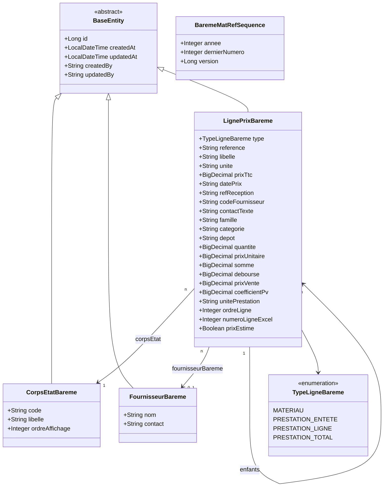

# Diagramme de Classes — 12 · Barème & Référentiel de Prix



## Tables DB

| Entité | Table |
|--------|-------|
| CorpsEtatBareme | `bareme_corps_etat` |
| FournisseurBareme | `bareme_fournisseurs` |
| LignePrixBareme | `bareme_lignes_prix` |
| BaremeMatRefSequence | `bareme_mat_ref_sequence` |

## Structure du barème

Le barème est importé depuis un fichier Excel structuré en feuilles (= corps d'état) :

```
CorpsEtatBareme (ex. "Gros-Oeuvre", "Électricité", "Plomberie")
  └── LignePrixBareme (MATERIAU)          → ligne référentiel prix matériaux
  └── LignePrixBareme (PRESTATION_ENTETE) → titre d'un poste de prestation
       └── LignePrixBareme (PRESTATION_LIGNE)  → détail de décomposition
       └── LignePrixBareme (PRESTATION_TOTAL)  → total Déboursé / Prix Vente
```

## Référence matériaux

`BaremeMatRefSequence` gère l'allocation atomique des références matériaux au format `MAT-YYYY-NNNNN` (verrou optimiste via `@Version`).

## Champs selon le type

| Champ | MATERIAU | PRESTATION_ENTETE | PRESTATION_LIGNE | PRESTATION_TOTAL |
|-------|----------|------------------|-----------------|-----------------|
| `reference` | ✓ | — | — | — |
| `libelle` | ✓ | ✓ | ✓ | ✓ |
| `unite` + `prixTtc` | ✓ | — | — | — |
| `famille` / `categorie` | ✓ | — | — | — |
| `fournisseurBareme` | ✓ | — | — | — |
| `quantite` / `prixUnitaire` / `somme` | — | — | ✓ | — |
| `debourse` / `prixVente` | — | — | — | ✓ |
| `parent` | — | — | ✓ | ✓ |
